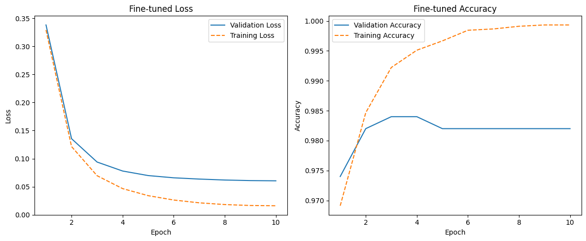
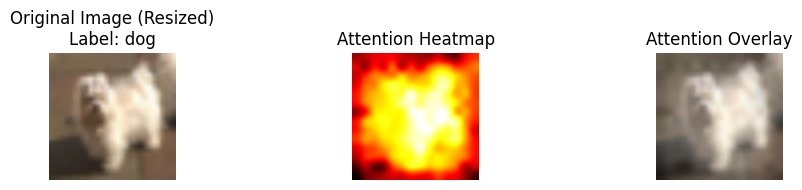
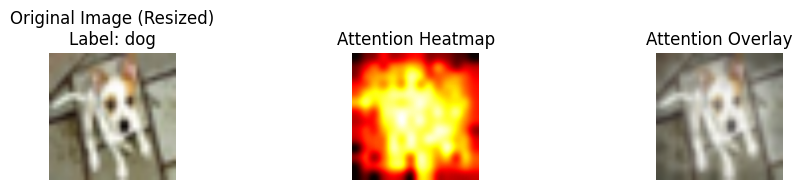
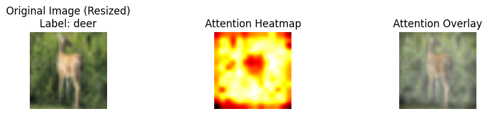
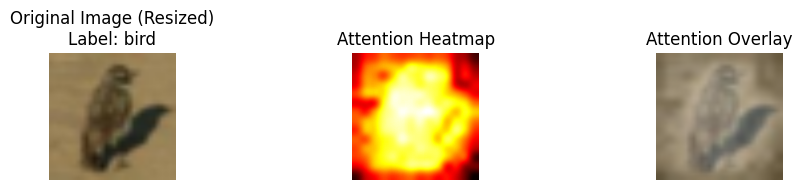
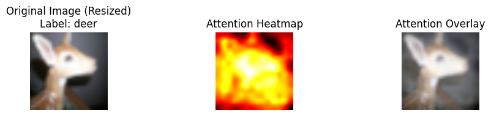

# Fine-tune-Vision-Transformer-on-CIFAR10

This repository contains a fine-tuned Vision Transformer (ViT) model for image classification on the CIFAR-10 dataset. The project leverages the Hugging Face `Trainer` class for efficient training and implements a method to visualize the attention maps of the Vision Transformer.

## What is a Vision Transformer? 
A Vision Transformer (ViT) is a type of neural network model designed for image classification tasks. Unlike traditional convolutional neural networks (CNNs), Vision Transformers use self-attention mechanisms from the transformer architecture, originally developed for natural language processing. The image is divided into smaller patches, which are then linearly embedded and processed similarly to tokens in NLP transformers. This allows ViT to capture long-range dependencies within the image, making it highly effective for visual tasks.

*Visualization of a Vision Transformer architecture. Source: [Medium](https://medium.com)*

## Project Overview

- **Dataset**: CIFAR-10, a dataset containing 60,000 32x32 color images in 10 different classes.
- **Model**: Vision Transformer (ViT), fine-tuned on CIFAR-10 using Hugging Face's `transformers` library.
- **Training Framework**: Hugging Face `Trainer` class, which simplifies training and evaluation processes.
- **Attention Map Visualization**: Implemented a method to visualize the attention mechanism in the ViT model.

## Key Features

- **Fine-Tuning on CIFAR-10**: The ViT model has been trained and fine-tuned on CIFAR-10, achieving competitive performance.
- **Attention Map Visualization**: Attention maps are a great way to understand what the Vision Transformer focuses on. This project provides visualizations for better interpretability of the model.

## Results and Visualizations

### Training Metrics
Below is a graph of the loss and accuracy throughout the training process.

#### Interpretation of the Graphs

- **Loss Graph**: The loss graph shows the training and validation loss over the course of 10 epochs. Both training and validation loss decrease steadily, indicating that the model is learning effectively. The training loss decreases faster and continues to decrease further than the validation loss, which is typical as the model is optimizing itself for the training data. However, the validation loss stabilizes after a few epochs, which suggests that the model has reached a point where it generalizes well to unseen data without overfitting.

- **Accuracy Graph**: The accuracy graph shows the training and validation accuracy. The training accuracy increases quickly, reaching nearly perfect accuracy by the end of training. The validation accuracy also improves but plateaus around 98.5%. The gap between training and validation accuracy suggests a minor overfitting, as the model performs slightly better on the training data compared to the validation data. However, the relatively small difference indicates that the model has generalized well overall.

### Attention Maps
Here are some of the attention maps generated by the Vision Transformer for images from the CIFAR-10 dataset.

- 
- 
- 
- 
- 

These visualizations provide insights into which parts of the input image the model focuses on during classification.

